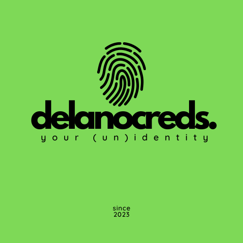
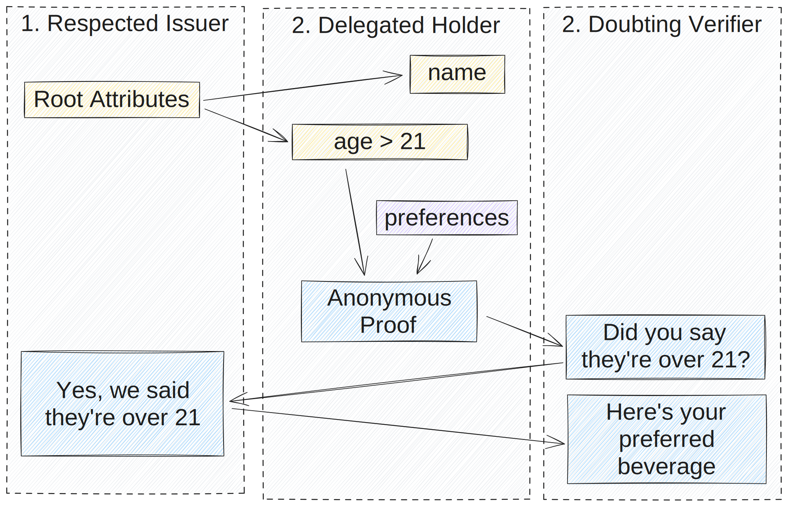

# Delano

The Delegateable Anonymous Credentials (DAC) system.

<!-- Center div -->
<div align="center">



</div>



This is a workspace broken down into:

- [delanocreds](/crates/delanocreds/): The core library for issuing and using anonymous credentials.
- [delano-wasm-bindgen](/crates/delano-wasm-bindgen/): Wasm-bindings for use in the browser through JavaScript
- [delano-wit-component](/crates/delano-wit-component/): Wasm Interface Types for [Wasm Component](https://github.com/WebAssembly/component-model) use from any [host system](https://github.com/bytecodealliance/wit-bindgen#host-runtimes-for-components) such as Go, JavaScript, Python or Rust.
- [examples](examples/): A simple demo that issues and verifies credentials

## Run Demo Binary

```bash
cargo run
```

## Tests

Workspace and integration tests are located in `./tests` and can be run with:

```bash
cargo test
```

Wasm test in `./tests/wasm.rs` using `wasm-bindgen-test` and [wasm-bindgen-cli](https://rustwasm.github.io/wasm-bindgen/wasm-bindgen-test/usage.html#appendix-using-wasm-bindgen-test-without-wasm-pack)

```bash
cargo test --target wasm32-unknown-unknown
```

## Build Wasm

```bash
cargo build --workspace --target wasm32-unknown-unknown
```
