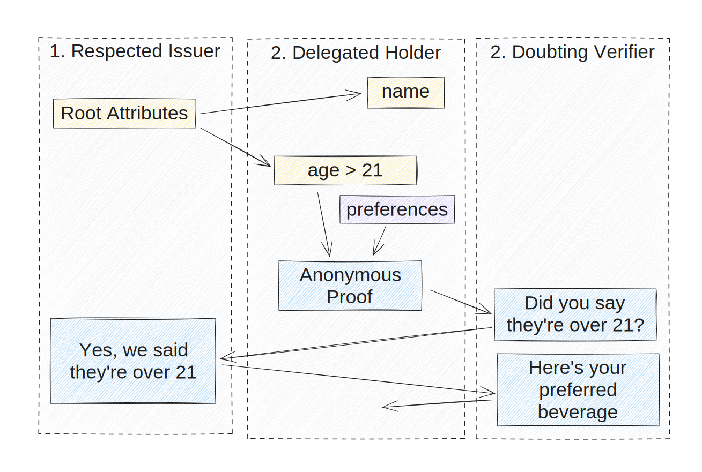

# Delano

The Delegateable Anonymous Credentials (DAC) system.

<!-- Center div -->
<div align="center">


</div>



This is a workspace broken down into:

-   [delano-crypto](/crates/delano-crypto/): A hierarchial Seed and secret manager for Delanocreds
-   [delano-wasm-bindgen](/crates/delano-wasm-bindgen/): Wasm-bindings for use in the browser through JavaScript
-   [delano-wit-component](/crates/delano-wit-component/): Wasm Interface Types for [Wasm Component](https://github.com/WebAssembly/component-model) use from any [host system](https://github.com/bytecodealliance/wit-bindgen#host-runtimes-for-components) such as Go, JavaScript, Python or Rust.
-   [delanocreds](/crates/delanocreds/): The core library for issuing and using anonymous credentials.
-   [examples](examples/): A simple demo that issues and verifies credentials

## Run Demo Binary

```bash
cargo run
```
